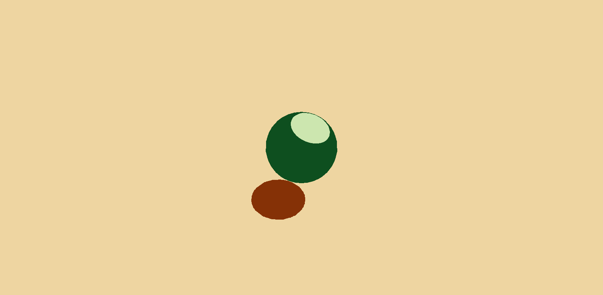
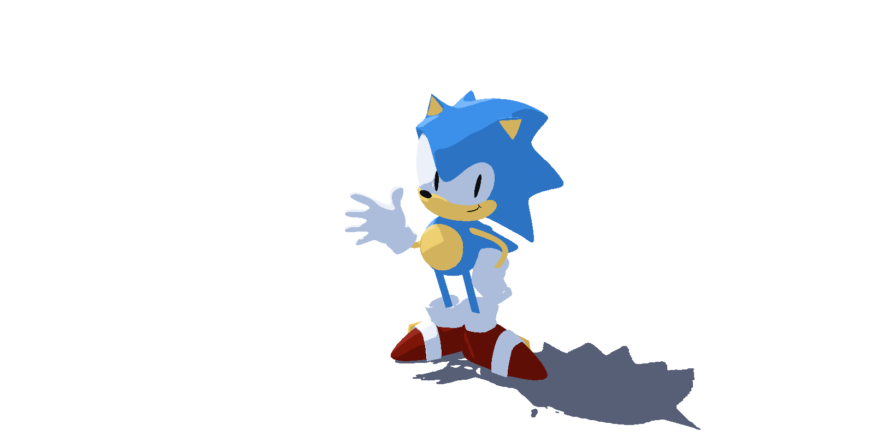
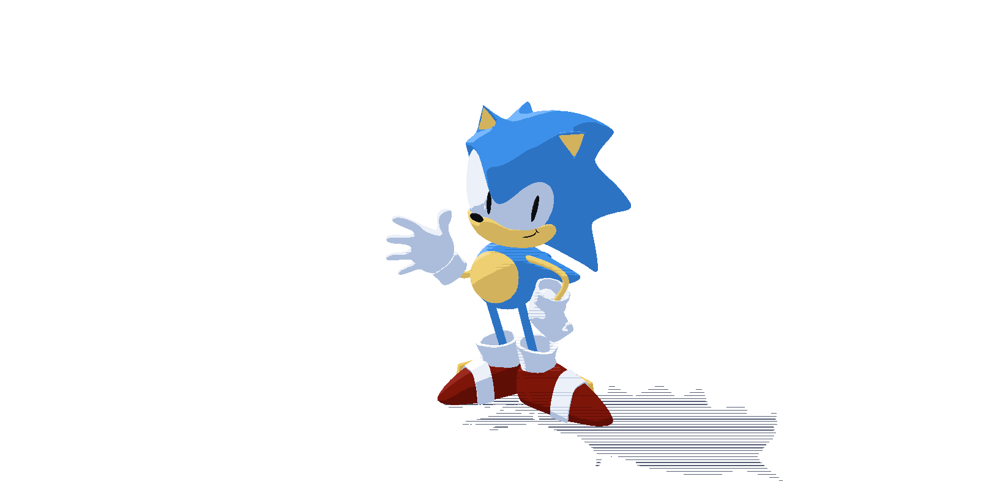

# Lab 03 - Stylization!
Let's practice adding stylization to a 3D scene using Unity's shader graph!

## Introduction
We will be stylizing a "toon" look by creating a shader in Unity that supports shadows and multiple lights in real-time! In the process, you will gain some familiarity with Unity’s shader graph.

## What’s provided:
This tutorial video will cover the base code, and then go over the process of making a limited version of a toon shader.

Start by downloading Unity 2022.3.9f1

[Lab Overview and Puzzle 1 Tutorial Video](https://youtu.be/jc5MLgzJong)
         
## Lab Puzzles:
The goal of each puzzle will be to replicate the look of each puzzle’s image.

### 1. Puzzle 1: Simple two-tone toon shading

   * Follow the tutorial to create a 2 band toon shader, and then create multiple materials based off of the shader graph
   * Attach those materials to the objects (the sphere and plane) in the default scene "Lab Scene 1" to produce a look similar to the one above!

### 2. Puzzle 2: Leveled-up toon shading

   * Edit your materials to allow for a 3rd color in your scene, such that you have highlights, midtones, shadows on your objects. Edit your shader so that the thresholds on these values are adjustable.
   * Shade the sonic and shadow receiving plane in "Lab Scene 2" to get a look similar to the one above!

### 3. Puzzle 3: Stylized Shadow

   * Use one of the provided texture png’s in order to add a screenspace shadow pattern onto the shadows of the scene!
   * Hint 1: What does the "ShadowAttenuation" variable do?
  
Extra Credit:
 * Add some soft interpolation at the edges of your bands, for smooth transitions between color bands. Create a "smoothness" parameter that adjusts the degree of smoothness!

# Submission:
- Create a pull request against this repository
- In your readme, add screenshots of your results for Puzzles 1, 2 and 3
- Profit

# Results

## Puzzle 1: Two-tone toon shading

The graph gets the main light through the `GetMainLight` custom function, takes `saturate(dot(worldNormal, lightDir))`, multiplies by distance and shadow attenuation, and picks between a highlight and a shadow color at an adjustable threshold. The result is multiplied by the light color before going to Base Color. `Toon_Sphere` and `Toon_Plane` are two materials made from the same graph.

## Puzzle 2: Three-tone toon shading

The color pick was moved into `ChooseColor3` in `LightingHelp.hlsl`, which takes highlight, midtone and shadow colors plus two thresholds (`ThresholdHigh`, `ThresholdLow`). Sonic uses one material per FBX material slot (`Sonic_Blue`, `Sonic_Skin`, `Sonic_Red`, `Sonic_White`, `Sonic_Black`, `Sonic_Gold`) and the plane uses `Sonic_Plane`, whose highlight matches the camera background.

## Puzzle 3: Stylized shadow

`ShadowAttenuation` is 0 inside a received shadow and 1 outside it, so the graph samples `Shadow 1.png` with the screen position (through Tiling And Offset and Rotate) and lerps the shadow attenuation toward 1 by the sampled value times `PatternStrength`. Where the texture is white the shadow is lifted back to the lit band, where it is black the shadow stays, which leaves a screen-space hatch pattern in every shadow.

## Extra credit: smoothness

`ChooseColor3` uses two `smoothstep` calls centered on the thresholds, with a half-width given by the `Smoothness` slider. Smoothness 0 gives hard bands (used in the puzzle screenshots), higher values blend the bands together. The screenshot above uses 0.7 on the Sonic materials.
