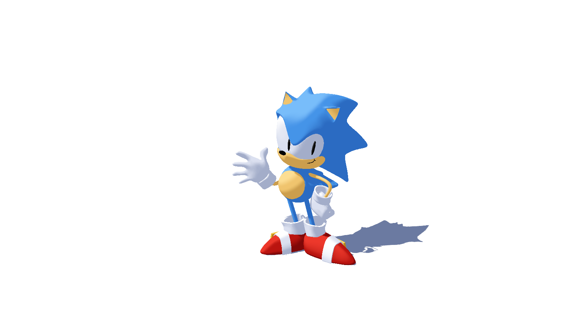
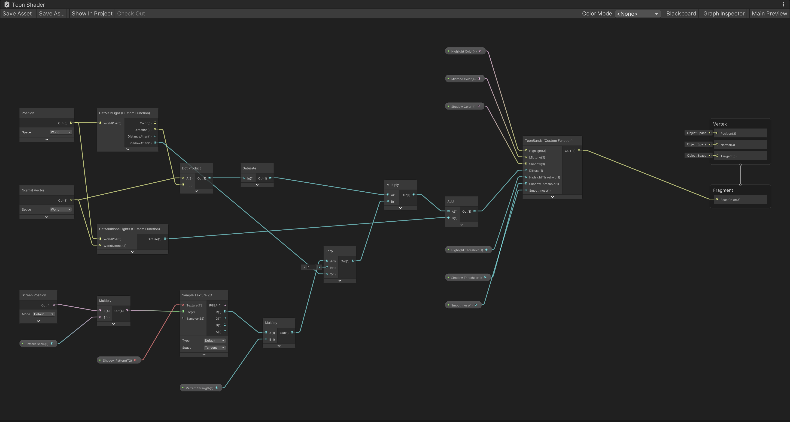

# Lab 03 - Stylization!
Let's practice adding stylization to a 3D scene using Unity's shader graph!

## Introduction
We will be stylizing a "toon" look by creating a shader in Unity that supports shadows and multiple lights in real-time! In the process, you will gain some familiarity with Unity’s shader graph.

## What’s provided:
This tutorial video will cover the base code, and then go over the process of making a limited version of a toon shader.

Start by downloading the latest version of Unity (the version used in the tutorial below is 2022.3.9f1, so there may be some small differences).

[Lab Overview and Puzzle 1 Tutorial Video](https://youtu.be/jc5MLgzJong)
         
## Lab Puzzles:
The goal of each puzzle will be to replicate the look of each puzzle’s image.

### 1. Puzzle 1: Simple two-tone toon shading


   * Follow the tutorial to create a 2 band toon shader, and then create multiple materials based off of the shader graph
   * Attach those materials to the objects (the sphere and plane) in the default scene "Lab Scene 1" to produce a look similar to the one above!

### 2. Puzzle 2: Leveled-up toon shading


   * Edit your materials to allow for a 3rd color in your scene, such that you have highlights, midtones, shadows on your objects. Edit your shader so that the thresholds on these values are adjustable.
   * Shade the sonic and shadow receiving plane in "Lab Scene 2" to get a look similar to the one above!

### 3. Puzzle 3: Stylized Shadow


   * Use one of the provided texture png’s in order to add a screenspace shadow pattern onto the shadows of the scene!
   * Hint 1: What does the "ShadowAttenuation" variable do?
  
Extra Credit:
 * Add some soft interpolation at the edges of your bands, for smooth transitions between color bands. Create a "smoothness" parameter that adjusts the degree of smoothness!

# Results

Everything is built off a single shader graph, `Assets/Shaders/Toon Shader.shadergraph`, with the lighting code in `Assets/Shaders/Includes/LightingHelp.hlsl`. Each puzzle has its own folder under `Assets/Materials/` and its own scene, so the three looks can be opened side by side without touching any material sliders.

| Scene | Materials | Look |
| --- | --- | --- |
| Lab Scene 1 | Materials/Puzzle 1 | two tone sphere + ground |
| Lab Scene 2 | Materials/Puzzle 2 | three tone Sonic, solid shadows |
| Lab Scene 3 | Materials/Puzzle 3 | three tone Sonic, hatched shadows |

## Puzzle 1: two tone


The graph grabs the main light through the `GetMainLight` custom function, dots the light direction against the world normal and saturates it. That diffuse term is multiplied by the main light's shadow attenuation so that cast shadows fall into the dark band too, which is what gives the sphere its brown shadow on the ground.

For the two tone materials I simply gave the highlight and midtone slots the same colour, so only the shadow threshold matters:

- `Sphere.mat`: pale green over dark green, shadow threshold 0.3
- `Ground.mat`: sand over brown, shadow threshold 0.15

## Puzzle 2: three tones


The `ChooseColor` function from the tutorial only picks between two colours, so I replaced it with `ToonBands`, which takes a highlight, midtone and shadow colour plus two thresholds:

```hlsl
float shadowToMid    = smoothstep(ShadowThreshold - halfWidth, ShadowThreshold + halfWidth, Diffuse);
float midToHighlight = smoothstep(HighlightThreshold - halfWidth, HighlightThreshold + halfWidth, Diffuse);
OUT = lerp(lerp(Shadow, Midtone, shadowToMid), Highlight, midToHighlight);
```

`Highlight Threshold` and `Shadow Threshold` are exposed as sliders on the material. Sonic is split into six materials (Blue, Skin, White, Red, Black, Gold), all using 0.7 / 0.3, and they are assigned through the material remap on the fbx importer rather than per renderer. The ground uses white for both upper bands and a slate blue for the shadow band so the only thing you see on the plane is the cast shadow.

Additional lights are also fed into the same banding: `GetAdditionalLights` loops over the point / spot lights hitting the fragment and adds their lambert term (times distance and shadow attenuation) to the main light's contribution before it goes through `ToonBands`. This is what lights up the side of the sphere facing the point light in scene 1.

## Puzzle 3: stylized shadows


`ShadowAttenuation` is 1 where the fragment is lit and drops to 0 where it is inside the main light's shadow map, so it tells us exactly where a cast shadow lands. Instead of multiplying the diffuse term by it directly, the graph does

```
shadowTerm = lerp(pattern * PatternStrength, 1, ShadowAttenuation)
```

where `pattern` is `Shadow 1.png` sampled with the screen position (`Screen Position` node, default mode, scaled by `Pattern Scale`). Fully lit pixels are untouched, but inside a shadow the light term becomes the stripe texture, so the white stripes stay in the lit band and the black stripes drop into the shadow band. Because the UVs come from screen space the stripes stay fixed to the screen and do not follow the geometry, which gives the printed look from the reference.

`Pattern Strength` scales the texture before the lerp. At 0 the shadow is solid (which is what the Puzzle 2 materials use), at 1 the shadow is the raw pattern. The `Shadow Pattern` texture defaults to black so a material with no texture assigned still gets a normal solid shadow.

## Extra credit: soft band edges



`ToonBands` uses `smoothstep` around each threshold with a half width of `Smoothness * 0.5`. With `Smoothness` at 0 the half width collapses to a tiny epsilon and the result is a hard step; increasing the slider widens the blend between neighbouring bands. The screenshot above is the Puzzle 2 Sonic with `Smoothness` at 0.3 on all six materials.

## Graph overview



Left to right: `Position` and `Normal Vector` feed the two lighting functions, the screen space branch samples the shadow pattern and lerps it against the shadow attenuation, the results are combined and then banded by `ToonBands` into the Base Color of the unlit URP target.

# Submission:
- Create a pull request against this repository
- In your readme, add screenshots of your results for Puzzles 1, 2 and 3
- Profit
