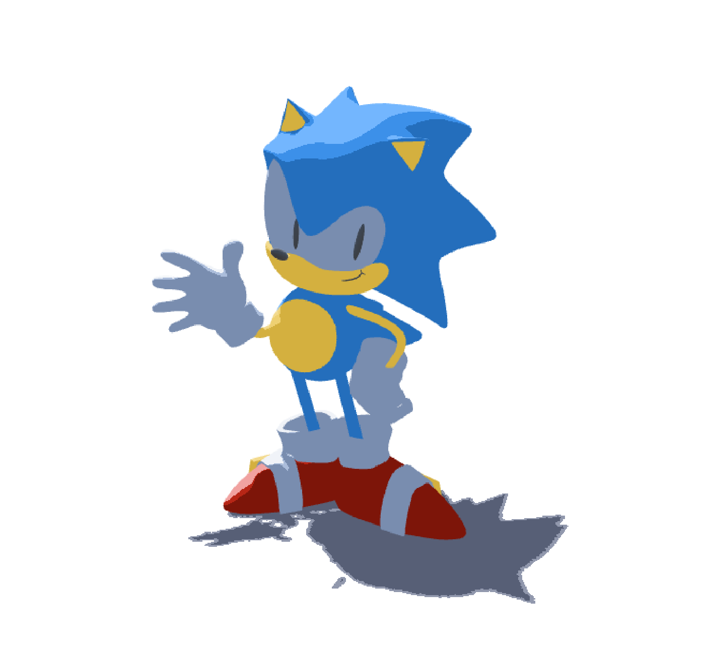
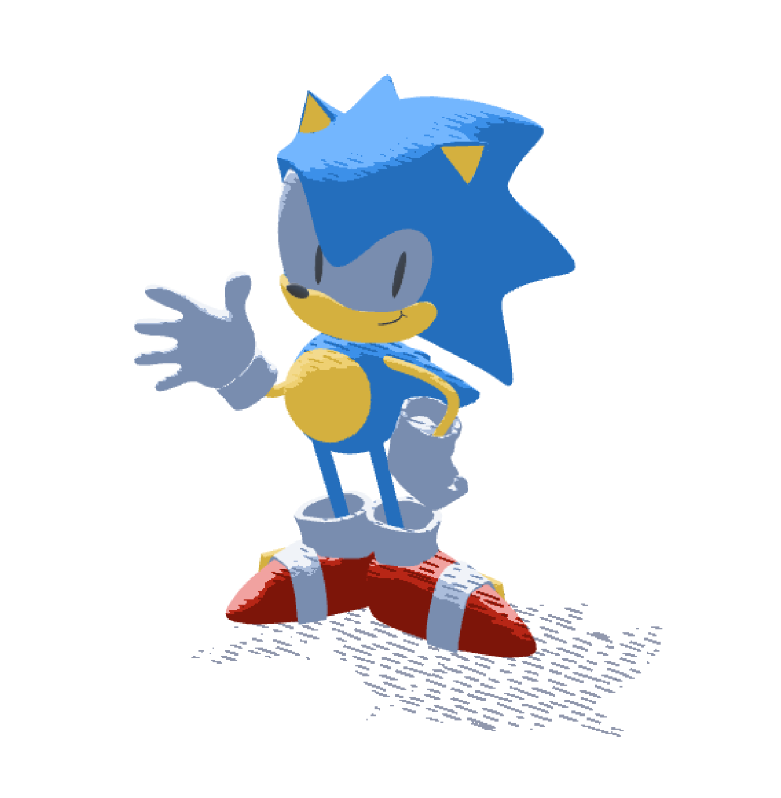

# Lab 03 - Stylization!
The lab instructions can be found [here](https://github.com/CIS-5660-Fall-2026/lab03-stylization/blob/main/README.md).

### 1. Puzzle 1: Simple two-tone toon shading

### 2. Puzzle 2: Leveled-up toon shading

Thank you to Nico for the help in figuring this step out.
### 3. Puzzle 3: Stylized Shadow

I referenced [this video](https://youtu.be/GiJbur0CrnU) to figure out how to texture the shadows.
