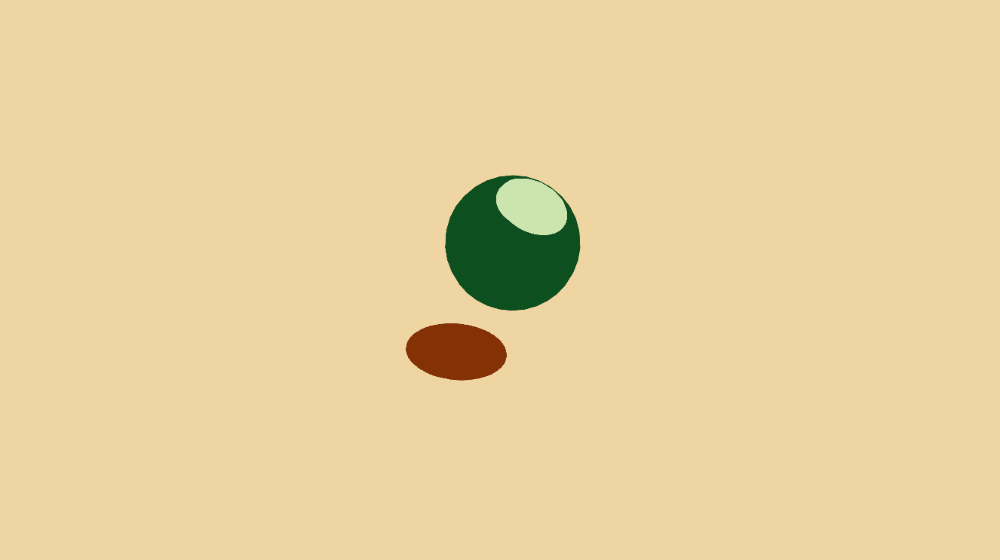
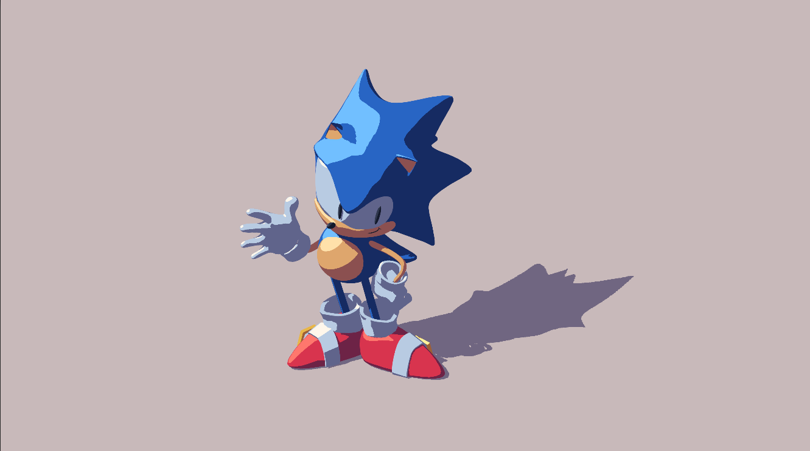
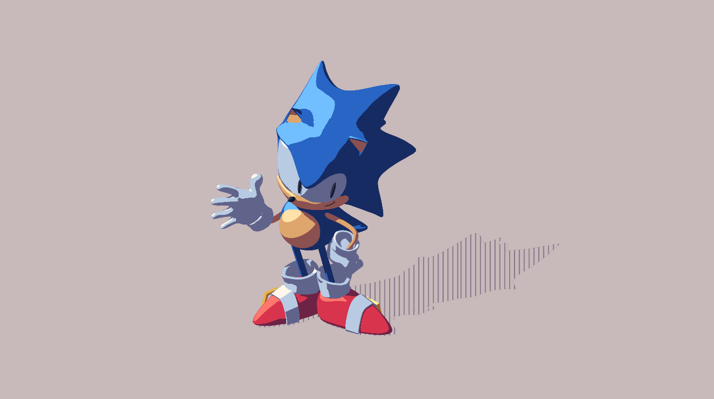
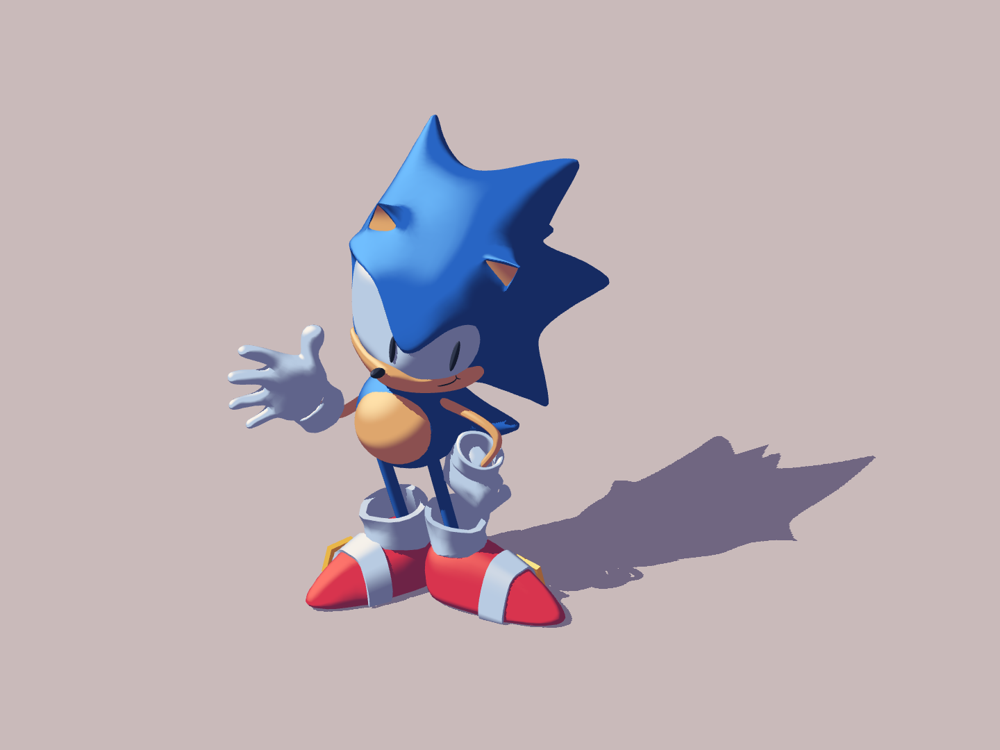

# Lab 03 - Stylization!
Let's practice adding stylization to a 3D scene using Unity's shader graph!

## Introduction
We will be stylizing a "toon" look by creating a shader in Unity that supports shadows and multiple lights in real-time! In the process, you will gain some familiarity with Unity’s shader graph.

## Results

The implementation uses **Assets/Shaders/Toon Shader.shadergraph**, a URP Unlit
Shader Graph with custom lighting functions in **Assets/Shaders/Includes/LightingHelp.hlsl**.
Each puzzle has its own saved scene and materials, so opening another puzzle does
not overwrite the previous result.

### Puzzle 1 — Two-tone shading

Open **Assets/Scenes/Lab Scene 1.unity**. The sphere and receiving plane each use
two palette colors. Directional and point lights are combined before applying the
threshold, preserving two color bands under multiple lights.

The palette is sampled from the supplied reference: light green **#CCE5AF**,
dark green **#0E4F1F**, sand-colored ground **#EED5A1**, and brown cast shadow
**#843106**. The sphere threshold is **0.704**. A perspective view and the light
direction reproduce the small upper-right highlight and lower-left shadow.

### Puzzle 2 — Three adjustable bands

Open **Assets/Scenes/Lab Scene 2.unity**. Sonic's blue, skin, glove, shoe, buckle,
and eye materials each have highlight, midtone, and shadow colors. Both band
thresholds are exposed on the material. The plane also receives real-time shadows.

### Puzzle 3 — Screen-space shadow texture

Open **Assets/Scenes/Lab Scene 3.unity**. The ground material uses
**Pattern Strength = 1** and the provided **Shadow 1.png** stripe texture.
Sonic's materials use **Pattern Strength = 0**, retaining ordinary toon shading
and self-shadows without stripes on the character. UVs
come from the Default-mode Screen Position node, with aspect-ratio correction.
The texture stays aligned with the screen rather than following the mesh UVs.

### Extra credit — Smooth transitions

**Smoothness = 0** selects hard color bands. Increasing it uses `smoothstep`
around each threshold. The width is limited to keep the midtone band intact.
The image below uses **0.22**; the saved puzzle materials retain hard bands.

### Controls and implementation

Select a material in **Assets/Materials/Toon** to adjust these properties:

| Property | Effect |
| --- | --- |
| Highlight / Midtone / Shadow | The palette colors |
| Three Bands | 0 = two bands; 1 = three bands |
| Shadow Threshold | Shadow-to-midtone boundary, or the two-band boundary |
| Highlight Threshold | Midtone-to-highlight boundary |
| Smoothness | Width of the band transitions; 0 gives a hard step |
| Shadow Pattern | Either supplied pattern texture, or another repeating mask |
| Pattern Scale | Texture repetitions across the screen height |
| Pattern Strength | Per-material receiver control: 1 on the Puzzle 3 floor, 0 on Sonic |

The graph reads world position and world normal, then calls `ToonLighting`.
For each light, the illumination is `max(dot(N, L), 0)` multiplied by distance
attenuation and light-color luminance. It accumulates both an unoccluded value
and a value multiplied by each light's `shadowAttenuation`, then quantizes the
combined lighting in `ToonBands`. Light hue is intentionally represented by the
chosen material palette; light intensity and luminance affect band selection.

`ShadowMask = 1 - visibleIllumination / unoccludedIllumination` measures the
fraction blocked by occlusion (zero when there is no incident light).
`PatternShadow` uses this mask to place dark ink and unshadowed palette color
inside cast shadows on materials with Pattern Strength enabled. Occlusion
includes self-shadowing, so the Puzzle 3 scene enables the pattern only on the
floor. Sonic continues to cast and receive normal shadows. A surface that merely
faces away from a light keeps its ordinary shadow band. Additional lights can
illuminate another light's shadow naturally.

The URP lighting keywords are **Global / Multi Compile**. The graph retains
shadow-caster and depth passes. The provided Forward renderer uses per-pixel
additional lights, and its shadow distance is reduced to fit these small scenes.
Pattern textures use Repeat wrapping, linear sampling, and mipmaps.

All ten rendering/compilation checks passed, covering lighting, palette controls,
the ground pattern, and the choice of receiving surface. With the floor hidden
from the camera, disabling
the pattern must leave Sonic unchanged, while disabling light shadows must still
change its ordinary self-shadowing. The checks also require zero visible pattern
changes when all cast shadows are disabled.

The corrected scene changed 0 pixels on Sonic when disabling patterns, while
turning off normal self-shadows changed 9,952 pixels at 1440 × 1080.

Custom HLSL is connected through Unity's
[Custom Function nodes](https://docs.unity3d.com/Packages/com.unity.shadergraph@14.0/manual/Custom-Function-Node.html).
The graph includes explanatory sticky notes for the lighting, palette, and
screen-space pattern stages.

### Reproduce and verify

Validated with **Unity 2022.3.62f2 / URP 14.0.12**. The original starter targeted
2022.3.9f1 / URP 14.0.9; the project package versions reflect the installed
2022.3 LTS editor used for rendering.

1. Open one of the three scenes and use the Game view.
2. Choose **Lab 03 > Capture all result screenshots** to render the PNGs directly
   from Unity: Puzzle 1 at 1440 × 810 (16:9, matching its reference framing), and
   the other three captures at 1440 × 1080 (4:3).
3. Choose **Lab 03 > Validate rendering controls** to compare rendered images
   while toggling lights, shadows, bands, thresholds, smoothing, and the pattern.
   The checks use temporary material copies and do not save their changes.
4. **Lab 03 > Rebuild demonstration materials and scenes** restores the supplied
   demonstration settings. This intentionally resets edits to those materials
   and the scene setup.

The original assignment follows below.

## What’s provided:
This tutorial video will cover the base code, and then go over the process of making a limited version of a toon shader.

Start by downloading Unity 2022.3.9f1

[Lab Overview and Puzzle 1 Tutorial Video](https://youtu.be/jc5MLgzJong)
         
## Lab Puzzles:
The goal of each puzzle will be to replicate the look of each puzzle’s image.

### 1. Puzzle 1: Simple two-tone toon shading

   * Follow the tutorial to create a 2 band toon shader, and then create multiple materials based off of the shader graph
   * Attach those materials to the objects (the sphere and plane) in the default scene "Lab Scene 1" to produce a look similar to the one above!

### 2. Puzzle 2: Leveled-up toon shading

   * Edit your materials to allow for a 3rd color in your scene, such that you have highlights, midtones, shadows on your objects. Edit your shader so that the thresholds on these values are adjustable.
   * Shade the sonic and shadow receiving plane in "Lab Scene 2" to get a look similar to the one above!

### 3. Puzzle 3: Stylized Shadow

   * Use one of the provided texture png’s in order to add a screenspace shadow pattern onto the shadows of the scene!
   * Hint 1: What does the "ShadowAttenuation" variable do?
  
Extra Credit:
 * Add some soft interpolation at the edges of your bands, for smooth transitions between color bands. Create a "smoothness" parameter that adjusts the degree of smoothness!

# Submission:
- Create a pull request against this repository
- In your readme, add screenshots of your results for Puzzles 1, 2 and 3
- Profit
